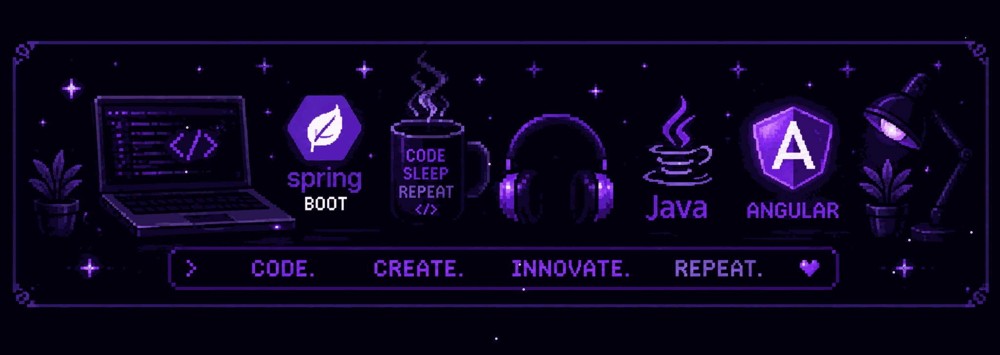
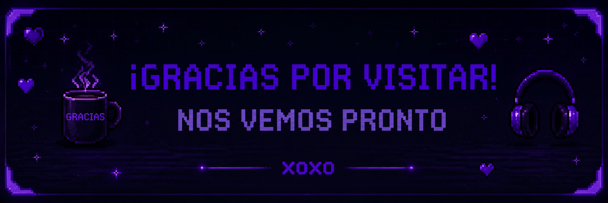

# ❄ Andy Valdivia ❄

### Full Stack Developer

Creación de aplicaciones escalables con Java y Angular

---

## Presentacion

Desarrollador Full Stack enfocado en construir aplicaciones escalables, mantenibles y orientadas a resolver problemas reales. Trabajo principalmente con Java, Spring Boot y Angular, desarrollando APIs REST, integrando bases de datos y aplicando principios de arquitectura limpia y buenas prácticas de ingeniería de software.

---

## Stack Tecnico

### Lenguajes

     

### Frameworks

  

### Bases de Datos

   
 

### Deploy y Cloud

   

### Herramientas

    

---

## GitHub

---

## Contacto

 

---

`Lima, Peru` `Cibertec 2024-2026` `Open to opportunities`

