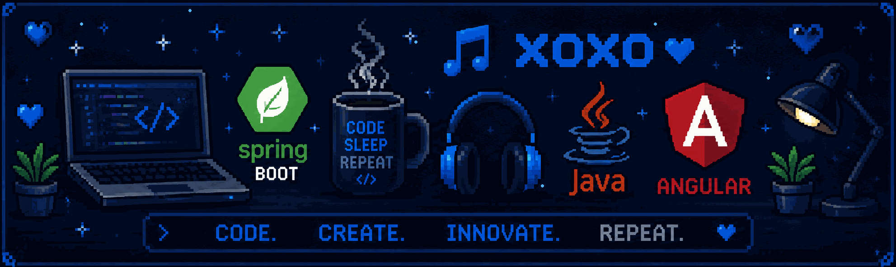

# ❄ Andy Valdivia ❄

### Full Stack Developer

`Backend` `Frontend` `APIs REST` `Microservicios` `Arquitectura Limpia`

---

## Presentacion

Desarrollador Full Stack orientado a construir productos escalables, mantenibles y listos para produccion. Trabajo principalmente con Java Spring Boot y Angular, integrando servicios, bases de datos y buenas practicas de arquitectura para resolver problemas reales de negocio.

---

## Stack Tecnico

### Lenguajes

     

### Frameworks

  

### Bases de Datos

   
 

### Deploy y Cloud

 

### Herramientas

    

---

## GitHub

---

## Contacto

 

---

`Lima, Peru` `Cibertec 2024-2026` `Open to opportunities`

